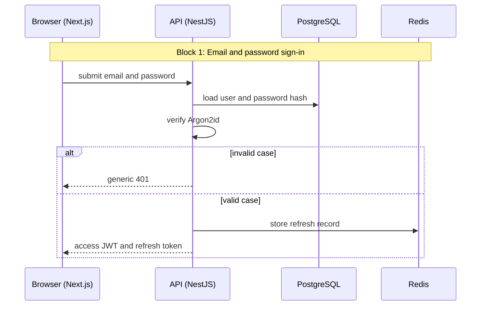
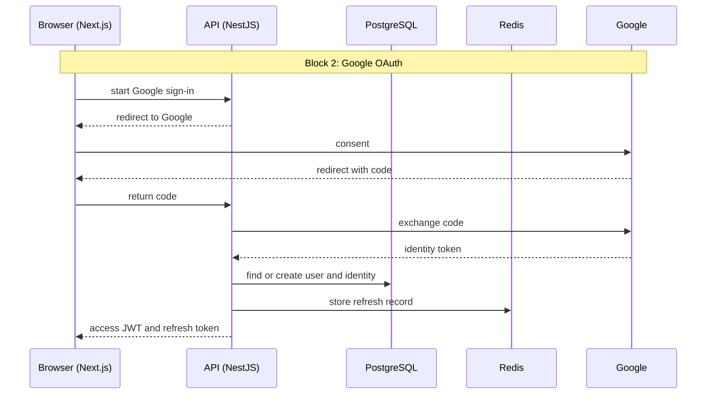
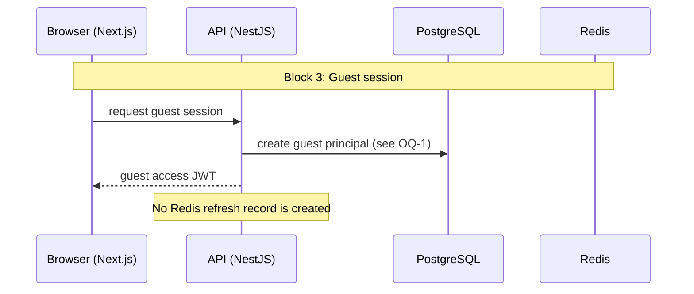
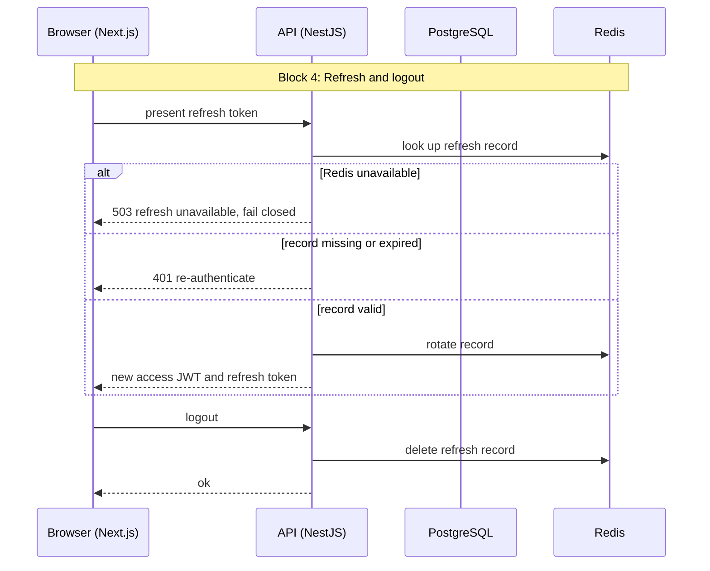

# Auth Flow

Status: PROVISIONAL

Note: The diagrams describe the target state. Redis arrives at Stage 1.

## Assumptions

- A-1: Refresh tokens are stored only in Redis. On a Redis outage, refresh fails closed and users re-authenticate. Postgres-backed reads are unaffected. Requires owner confirmation before P3/P4.
- A-2: Only a hash of the refresh token is stored in Redis (proposed; finalized in P4).
- A-3: Access-JWT validation is stateless and never queries Redis, so a Redis outage does not break authenticated requests for Postgres-backed data (Rule 6).
