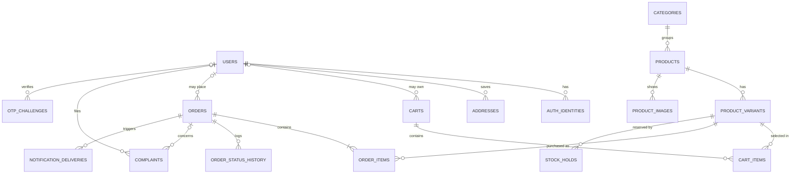

# ERD — Conceptual (Provisional)

Status: PROVISIONAL

Conceptual model only. Phase 0 introduces no tables, no Prisma models and no migrations. Columns are intentionally omitted (AGENTS.md Rule 1). The phase that introduces an entity defines its columns and records any change here (Rule 2).

## Entity register

| Entity | Module | Earliest phase |
|---|---|---|
| CATEGORIES, PRODUCTS, PRODUCT_VARIANTS, PRODUCT_IMAGES | catalog | P2 |
| USERS, AUTH_IDENTITIES | auth | P4 |
| ADDRESSES, CARTS, CART_ITEMS, ORDERS, ORDER_ITEMS, ORDER_STATUS_HISTORY, STOCK_HOLDS | cart / orders | P12 |
| OTP_CHALLENGES, NOTIFICATION_DELIVERIES | auth / notifications | P15 |
| COMPLAINTS | complaints | TBD (OQ-3) |

## Not in Postgres

Refresh-token records live in Redis (ADR 0002, assumption A-1).

## Open questions

- OQ-1: Are guests stored as USERS rows, or is a cart keyed by an anonymous token?
- OQ-2: Is STOCK_HOLDS a table, and does a hold belong to a cart or an order?
- OQ-3: The master context assigns COMPLAINTS to no phase.
