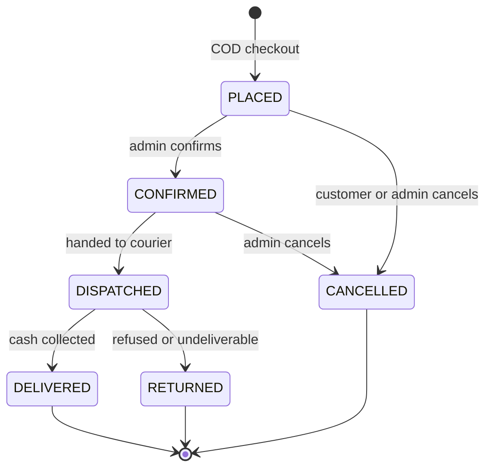

# Order state machine (Provisional)

Status: PROVISIONAL

States are proposed, not specified in the master context (flag F-2). P12 to P14 finalize them.

## Transitions

| From | To | Guard | Side effects |
|---|---|---|---|
| (start) | PLACED | valid cart, stock available | stock reserved |
| PLACED | CONFIRMED | current status is PLACED | notification enqueued |
| PLACED | CANCELLED | current status is PLACED | stock restored |
| CONFIRMED | DISPATCHED | current status is CONFIRMED | notification enqueued |
| CONFIRMED | CANCELLED | current status is CONFIRMED | stock restored |
| DISPATCHED | DELIVERED | current status is DISPATCHED | none |
| DISPATCHED | RETURNED | current status is DISPATCHED | stock restored (P12 to P14 decides inspection rules) |

DELIVERED, CANCELLED and RETURNED are terminal.

## Invariants

- **affected-row rule (Rule 8).** Each transition is one conditional update, `UPDATE orders SET status = :to WHERE id = :id AND status = :from`. Stock, hold or reservation restoration and notification enqueueing run in the same transaction and only when exactly one row was affected. Zero rows means no side effects.
- **Webhook rule (Rule 7).** A notification's delivered or failed outcome is set by the provider's webhook, never by the synchronous HTTP response. A notification failure never changes order status.
