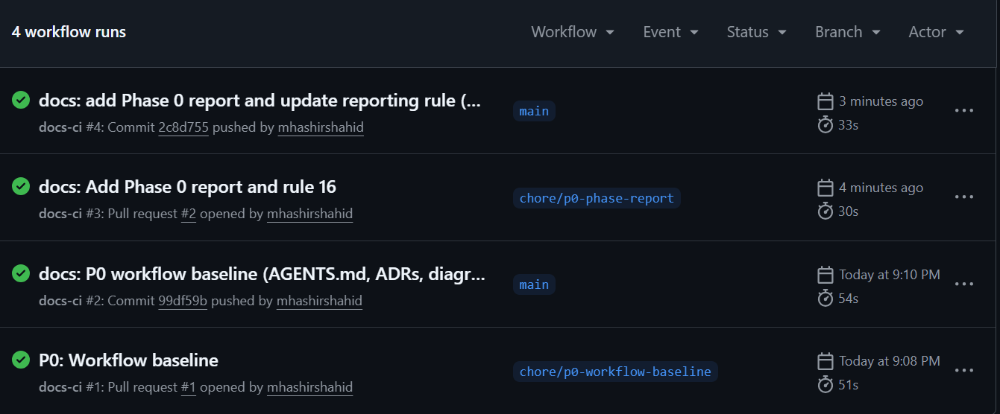

# Phase 0: Workflow Baseline

## Executive summary
Phase 0 established the foundational documentation, repository workflow rules, continuous integration (CI) skeleton, and branch protection policies. This phase lays the groundwork for all future development by defining strict agent rules, recording architectural decisions (ADRs), creating provisional diagrams, and ensuring all code is checked before merging. No application code was implemented.

## Modules modified
- **Documentation**: Initialized `AGENTS.md` as the binding contract. Created `/docs` directory housing initial ADRs and Mermaid diagrams.
- **CI/CD**: Configured `.github/workflows/docs-ci.yml` for continuous integration.
- **Tooling**: Created `scripts/verify-docs.mjs` for rigorous automated verification of documentation constraints.

## Technical implementation
- **Repository Setup**: Validated the environment and initialized the `main` branch.
- **Architectural Decision Records**:
  - `ADR 0001`: Decided on a NestJS modular monolith with a specific tech stack (Postgres, Redis, Next.js).
  - `ADR 0002`: Designated Postgres as the persistent source of truth and Redis for ephemeral data.
- **Diagrams**: Created provisional Mermaid diagrams for the Conceptual ERD, Order State Machine, and Auth Flow.
- **Continuous Integration**: Configured `docs-ci.yml` to trigger on pull requests and pushes, enforcing the execution of `verify-docs.mjs` and rendering Mermaid diagrams.
- **Branch Protection**: Configured GitHub branch protection to require linear history, disallow force pushes/deletions, and mandate successful CI checks before merging.

## Visual evidence

