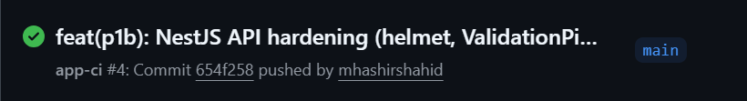
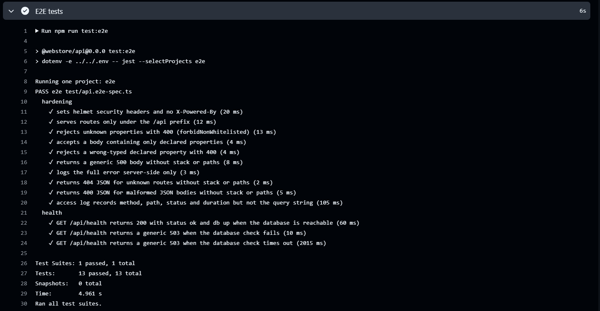
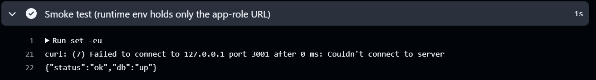

# P1B: API hardening

## Executive summary
Phase 1B successfully scaffolded the NestJS backend and applied critical global API hardening. The implementation included a generic exception filter to prevent error leakage, `helmet` integration for security headers, strict global `ValidationPipe` constraints (forbidding unknown fields), environment variable fail-fast validation, and a health endpoint that checks the Prisma connection securely. Automated unit, end-to-end (E2E), and CI-driven smoke tests verify all runtime invariants.

## Modules modified
- `apps/api/package.json` & `tsconfig.json`: Bootstrapped NestJS, Prisma, and Jest configurations.
- `apps/api/prisma/schema.prisma`: Appended the `prisma-client-js` generator block.
- `apps/api/src/env.ts`: Enforced strict, non-echoing validation for the runtime database connection (`DATABASE_URL`), explicitly forbidding superusers and DDL roles.
- `apps/api/src/configure-app.ts`: Unified global middleware (`helmet`), custom JSON access logs, and global error filtration (`AllExceptionsFilter`).
- `apps/api/src/health/health.controller.ts`: Provided the `/api/health` check with an explicit 2000ms query timeout.
- `.github/workflows/app-ci.yml`: Extended to run linting, tests, and a production smoke test against the running Postgres instance.
- `docs/README.md`: Updated with open flags F-13 through F-18.

## Technical implementation
- NestJS framework core packages, Prisma Client, and related TypeScript types were installed.
- Global `ValidationPipe` was set up with `{ whitelist: true, forbidNonWhitelisted: true }`.
- Test suites (`unit` and `e2e`) explicitly validated that the API safely masks secret values in exception payloads, returns structured HTTP responses for 4xx/5xx codes, outputs correct HTTP headers via `helmet`, and fails startup gracefully if misconfigured.
- CI Workflow updated to execute `generate`, `build`, `test`, `test:e2e`, and an automated smoke test asserting `{"status":"ok","db":"up"}` at runtime without DDL credentials.

## Visual evidence

## Flags and deviations
- Used `npm.cmd` directly due to execution policy overrides.
