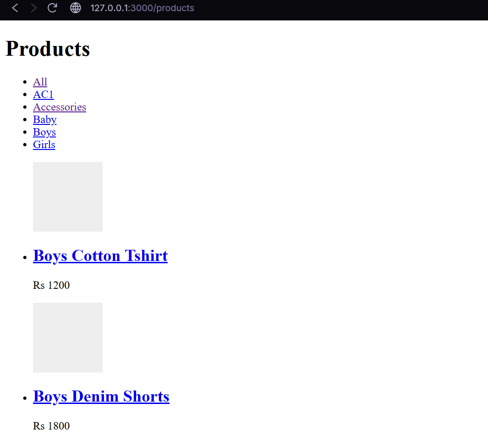

# P2: Catalog Read

## Executive Summary
Delivered Phase 2 containing the Postgres read-only catalog models (Categories, Products, Variants), the Next.js Storefront ISR cache fetching, and the NestJS REST API with a caching seam. E2E validated over a clean cold-start CI environment.

## Modules Modified
- `apps/api/prisma`: Appended `schema.prisma` models, appended raw `CHECK` constraints to migration.
- `apps/api/src/catalog`: Built standard NestJS components (`CatalogModule`, `CatalogController`, `CatalogService`, DTOs).
- `apps/web/app/products`: Scaffolded the Next.js frontend pages for category listings and detail views with robust fail-over.
- `scripts`: Created `verify-catalog.mjs` and updated CI workflows to integrate it.

## Technical Implementation
- **Endpoints:** Implemented `GET /api/categories`, `GET /api/products`, `GET /api/products/:slug` serving read-only inventory.
- **Key Logic:** Data structures map base prices into variants via `effectivePrice`. Unlisted or inactive products are strictly excluded via `where` clauses at the Prisma level.
- **Schema Changes:** Created `Category`, `Product`, and `ProductVariant` entities with self-referential relations (for Category hierarchy) and custom non-negative database-level `CHECK` bounds on prices.
- **Cache Seam:** Abstracted standard `get`/`set` methods in `CatalogCache` which runs via an ephemeral in-memory placeholder (`NoopCatalogCache`) until Redis is mandated in Phase 3.

## Visual Evidence

## Flags and Deviations
- Fixed a pre-existing Web Dockerfile permission defect (F-31) that crashed the ISR caching layer due to root ownership of `.next`. Corrected with `COPY --chown=node:node`.
- Web assertions adapted to discard React 19 SSR hydration boundary nodes (`<!-- -->`) that skewed static raw HTML string matching.
