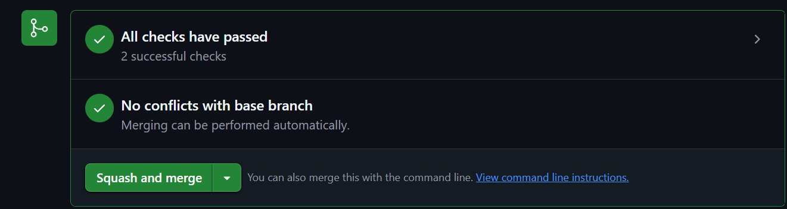
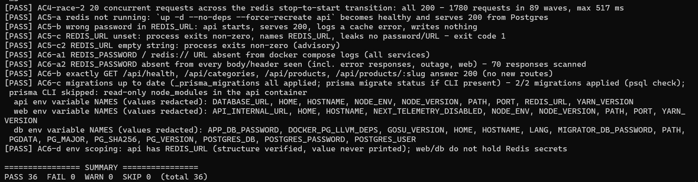
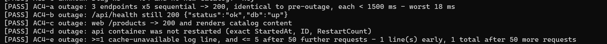

# P3: Catalog cache

## Executive summary

Phase 3 adds a live Redis cache to the API. The `NoopCatalogCache` placeholder from P2 is replaced with `RedisCatalogCache`, which stores product-list results in Redis with a 300-second TTL. If Redis is unavailable (network error, timeout, or restart), the API degrades gracefully: every request falls through to Postgres, no 5xx is returned, and a single warn log is emitted on the first failure. The cache self-heals when Redis reconnects, logging a recovery message. All security constraints (password auth, no published port, non-root container) are enforced from the first start.

## Modules modified

- `scripts/verify-docs.mjs` — Retired the Stage-0 Redis FORBIDDEN_COMPOSE_PATTERNS guard (F-37, authorized).
- `scripts/verify-stack.mjs` — Updated expected services list from `api,db,web` to `api,db,redis,web` (F-37, authorized).
- `scripts/verify-cache.mjs` — New: AC1–AC6 integration checks for Redis auth, key presence, graceful degradation, and recovery.
- `.env.example` — Added `REDIS_PASSWORD=` placeholder with generation instructions.
- `docker-compose.yml` — Added `redis` service with AOF persistence, volatile-lru eviction, password auth, no port binding, non-root user; added `REDIS_URL` to `api` environment; added `redis-data` top-level volume.
- `apps/api/src/env.ts` — Added `REDIS_URL` field to `Env` interface and validation in `readEnv`.
- `apps/api/src/env.spec.ts` — Added `REDIS_URL` to test fixture and appended 4 REDIS_URL validation tests.
- `apps/api/src/catalog/catalog-cache.ts` — Unchanged (interface and NoopCatalogCache retained).
- `apps/api/src/catalog/redis-catalog-cache.ts` — New: `RedisCatalogCache` with ioredis, degradation logic, rate-limited error logging, and `OnModuleDestroy` cleanup.
- `apps/api/src/catalog/redis-catalog-cache.spec.ts` — New: 12 unit tests covering get/set paths, degradation lifecycle, and destroy.
- `apps/api/src/catalog/catalog.module.ts` — Replaced `useClass: NoopCatalogCache` with factory that instantiates `RedisCatalogCache` from validated `REDIS_URL`.
- `apps/api/test/redis-degraded.e2e-spec.ts` — New: 16 e2e tests asserting Postgres fallback when REDIS_URL points to an unreachable port.
- `.github/workflows/app-ci.yml` — Additive: generates `REDIS_PASSWORD` and `REDIS_URL` in CI `.env`; starts Redis alongside Postgres; passes `REDIS_URL` to smoke test; runs `verify-cache` after `verify-stack`.
- `docs/README.md` — Appended flags F-32 through F-37.
- `docs/phase-reports/P3-catalog-cache.md` — This file.

## Technical implementation

**ioredis options:** `enableOfflineQueue: false` ensures commands fail immediately when disconnected (no queue build-up); `maxRetriesPerRequest: 1` limits per-command retry cost; `connectTimeout: 1000ms`, `commandTimeout: 250ms` bound worst-case latency contribution to the request; `keepAlive: 5000ms` maintains the TCP socket; `retryStrategy` uses exponential back-off capped at 5 s.

**Degradation seam:** `get` short-circuits on `client.status !== 'ready'` and returns `null`; `set` is a no-op. Cache misses cause `CatalogService` to fall through to Postgres unconditionally — the caller never knows.

**Logging contract:** A single `warn` is emitted on the first failure (healthy → degraded). Subsequent client error events are rate-limited to one `warn` per 30 seconds (only `err.code ?? err.name` is logged — no URL, password, key, or value). A `log` message is emitted when `ready` fires after degraded state.

**Security:** Redis runs as UID 999 (`redis` user), all Linux capabilities dropped, `no-new-privileges`, no host port binding. Auth is required via `--requirepass`. The healthcheck uses `REDISCLI_AUTH` environment variable so the password never appears in `ps` output.

**TTL clamping:** `set` clamps `ttlSeconds` to `[1, 600]` regardless of what the service passes, preventing accidental indefinite caching.

## Visual evidence

## Flags and deviations

- **F-37** (guardrail retirement): `verify-docs.mjs` Stage-0 Redis guard and `verify-stack.mjs` services assertion both updated as authorized in the pre-flight clearance.
- The ioredis retry timer causes a "worker process failed to exit gracefully" Jest warning in e2e — the test suite still exits 0 and all tests pass. This is a known ioredis/Jest interaction; `detectOpenHandles` would surface it. No fix is required at this scale.
